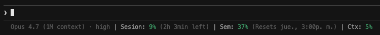

# claude-usage-statusline

A Claude Code statusline that colors your rate-limit usage by **consumption pace**, not just absolute thresholds.



## Why this one

Most statuslines color your usage green/yellow/red based on fixed percentages (50% = yellow, 80% = red). That's misleading: being 50% used 30 minutes into a 5-hour window is actually a problem — you're burning through the window 5x faster than expected.

`claude-usage-statusline` compares your **consumption rate vs time elapsed** in the window:

- **Green** — on pace or under pace
- **Yellow** — consuming ~15% faster than expected
- **Red** — consuming ~50% faster than expected

You find out you're on track to hit the limit *before* you hit it, not after.

## What it shows

```
Opus 4.7 (1M context) · high | Session: 9% (2h 3min left) | Week: 37% (Resets Thu, 3:00PM) | Ctx: 5%
```

- **Model + effort level** (from `CLAUDE_CODE_EFFORT_LEVEL` env var or `settings.json`)
- **Session** — 5-hour rate limit, pace-aware color, relative time to reset
- **Week** — 7-day rate limit, pace-aware color, absolute day/time of reset
- **Ctx** — context window used, absolute threshold color

## Requirements

- `bash` or `sh`
- `jq`
- `date` (works with both BSD — macOS — and GNU — Linux)

## Install

### Option A — As a plugin (recommended)

Install the plugin:

```
/plugin marketplace add crisandrews/claude-usage-statusline
/plugin install claude-usage-statusline@crisandrews
```

Restart Claude Code. On the next session start the plugin copies its script to a short, stable path (`~/.claude/claude-usage-statusline.sh`) and — if you don't have a statusline configured yet — shows a system message with the exact line to paste:

```
claude-usage-statusline is installed but the statusline is not yet enabled.

To enable it, paste this line into Claude Code:

/statusline please install and use this statusline: ~/.claude/claude-usage-statusline.sh
```

Paste that line back. Claude Code's built-in `/statusline` handler edits your `~/.claude/settings.json` for you.

Why the short path? Plugins live in `~/.claude/plugins/cache/<marketplace>/<plugin>/<version>/`, and the version folder changes on every update, which would break `statusLine.command` after each upgrade. The plugin mirrors its script to `~/.claude/claude-usage-statusline.sh` on every session start, so your settings.json stays valid across updates and automatically picks up the latest version.

If you dismissed the hint, or you already have another statusline but want to switch, run `/usage-statusline-setup` any time to get the line again.

> Claude Code plugins can't set `statusLine` automatically — that key lives in user settings only. A one-time paste is as close to zero-config as the platform allows.

### Option B — Manual install

1. Download `statusline-command.sh` into `~/.claude/`:
   ```sh
   curl -o ~/.claude/statusline-command.sh https://raw.githubusercontent.com/crisandrews/claude-usage-statusline/main/statusline-command.sh
   chmod +x ~/.claude/statusline-command.sh
   ```
2. Add to `~/.claude/settings.json`:
   ```json
   {
     "statusLine": {
       "type": "command",
       "command": "bash /Users/YOUR_USER/.claude/statusline-command.sh"
     }
   }
   ```
3. Restart Claude Code.

## Customization

All tweaks live in `statusline-command.sh`:

- **Rate thresholds** — change `115` (yellow) and `150` (red) in `colorize_rate()` to adjust sensitivity.
- **Context thresholds** — change `50` (yellow) and `80` (red) in `colorize()`.
- **Labels** — the segment labels (`Session`, `Week`, `Ctx`) are plain strings; translate or rename as you like.
- **Order / segments** — each segment is an `if` block near the bottom; reorder, remove, or add your own.

## How the pace math works

For each rate-limit window:

```
ratio = used_pct * window_secs / elapsed_secs
```

If `ratio ≥ 150` → red. If `ratio ≥ 115` → yellow. Else green.

Example: 5-hour window, 30 min elapsed (10% of window), 50% used →
`ratio = 50 * 18000 / 1800 = 500` → red.

If the API doesn't return reset time, the script falls back to absolute thresholds (50%/80%).

## License

MIT — see [LICENSE](LICENSE).
